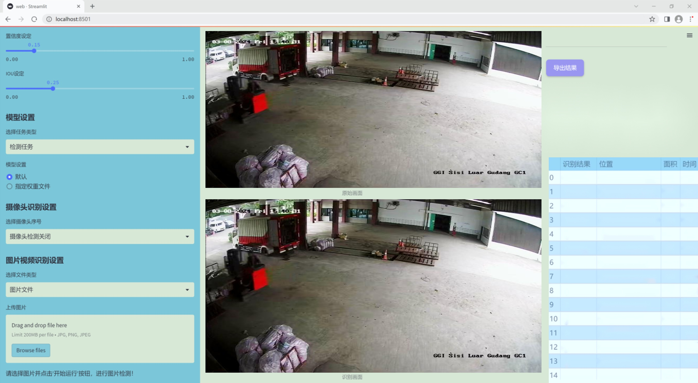
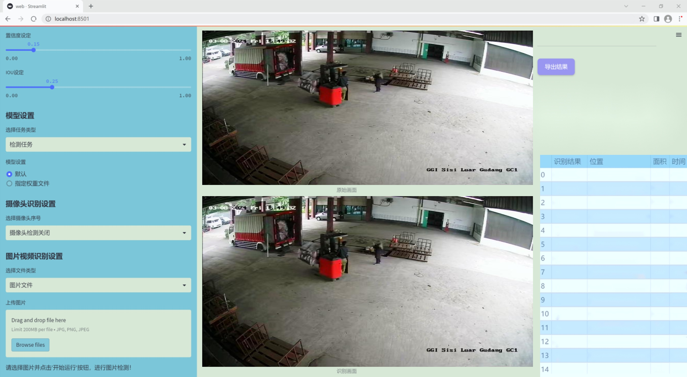
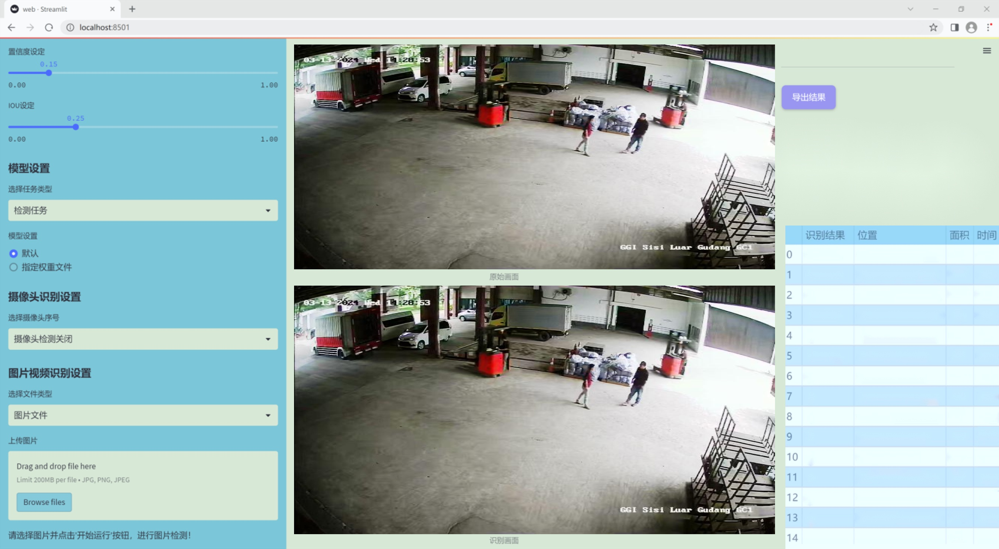
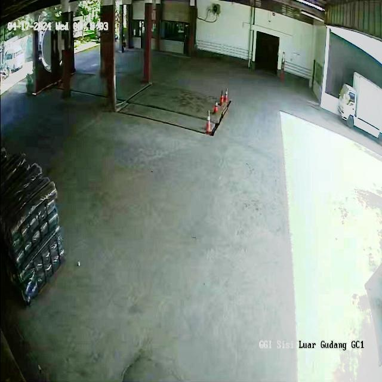
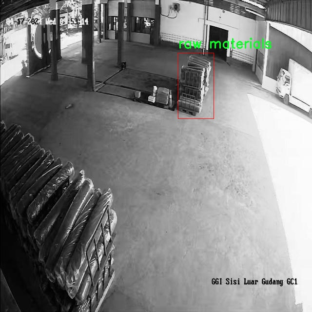
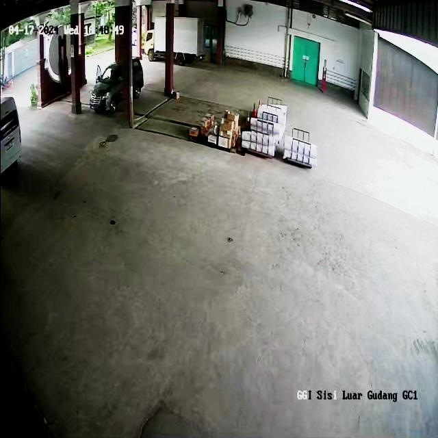
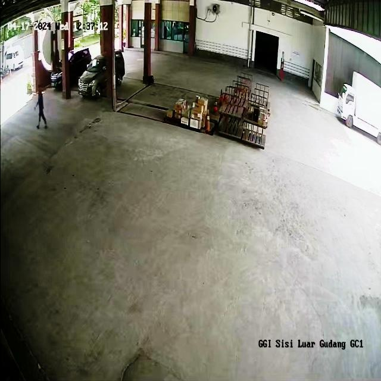
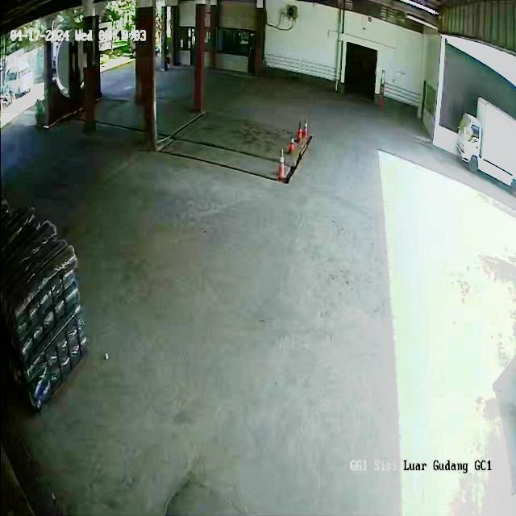

# 改进yolo11-DGCST等200+全套创新点大全：仓库新卸物料检测系统源码＆数据集全套

### 1.图片效果展示







##### 项目来源 **[人工智能促进会 2024.11.03](https://kdocs.cn/l/cszuIiCKVNis)**

注意：由于项目一直在更新迭代，上面“1.图片效果展示”和“2.视频效果展示”展示的系统图片或者视频可能为老版本，新版本在老版本的基础上升级如下：（实际效果以升级的新版本为准）

  （1）适配了YOLOV11的“目标检测”模型和“实例分割”模型，通过加载相应的权重（.pt）文件即可自适应加载模型。

  （2）支持“图片识别”、“视频识别”、“摄像头实时识别”三种识别模式。

  （3）支持“图片识别”、“视频识别”、“摄像头实时识别”三种识别结果保存导出，解决手动导出（容易卡顿出现爆内存）存在的问题，识别完自动保存结果并导出到tempDir中。

  （4）支持Web前端系统中的标题、背景图等自定义修改。

  另外本项目提供训练的数据集和训练教程,暂不提供权重文件（best.pt）,需要您按照教程进行训练后实现图片演示和Web前端界面演示的效果。

### 2.视频效果展示

[2.1 视频效果展示](https://www.bilibili.com/video/BV1aZSyY1EbB/)

### 3.背景

研究背景与意义

随着全球经济的快速发展和电子商务的蓬勃兴起，仓储物流行业面临着前所未有的挑战与机遇。传统的物料管理方式已难以满足现代化仓库对效率、准确性和实时性的高要求。尤其是在新卸物料的检测与管理中，如何快速、准确地识别和分类不同类型的物料，成为了提升仓库运营效率的关键因素之一。基于此背景，开发一套高效的仓库新卸物料检测系统显得尤为重要。

本研究旨在基于改进的YOLOv11模型，构建一个高效的仓库新卸物料检测系统。YOLO（You Only Look Once）系列模型因其优越的实时检测能力和高精度，已广泛应用于各类物体检测任务。通过对YOLOv11模型的改进，我们期望在检测速度和准确性上实现进一步的提升，以适应仓库环境中复杂多变的物料特征。

本项目所使用的数据集“Module 3”包含495张图像，涵盖了1个类别，主要涉及叉车、托盘和原材料等物料。这些数据不仅为模型的训练提供了丰富的样本，也为后续的模型评估和优化奠定了基础。通过对这些物料的准确识别，仓库管理人员能够实时掌握新卸物料的种类和数量，从而提高仓库的运营效率，降低人工成本，减少物料损失。

此外，随着人工智能技术的不断进步，基于深度学习的物体检测系统在智能仓储中的应用前景广阔。通过本研究的实施，不仅可以推动仓储行业的智能化转型，还能为相关领域的研究提供有价值的参考与借鉴。因此，基于改进YOLOv11的仓库新卸物料检测系统的研究，具有重要的理论意义和实际应用价值。

### 4.数据集信息展示

##### 4.1 本项目数据集详细数据（类别数＆类别名）

nc: 3
names: ['forklite', 'pallete', 'raw materials']


该项目为【目标检测】数据集，请在【训练教程和Web端加载模型教程（第三步）】这一步的时候按照【目标检测】部分的教程来训练

##### 4.2 本项目数据集信息介绍

本项目数据集信息介绍

本项目所使用的数据集名为“Sisi gudang”，旨在为改进YOLOv11的仓库新卸物料检测系统提供强有力的支持。该数据集专注于仓库环境中常见的物料种类，包含三类主要对象，分别是“forklite”（叉车）、“pallete”（托盘）和“raw materials”（原材料）。通过对这些类别的精确标注和丰富的样本收集，Sisi gudang数据集为算法的训练提供了多样化的场景和条件，确保了模型在实际应用中的鲁棒性和准确性。

在数据集的构建过程中，研究团队对每一类物料进行了详尽的图像采集，涵盖了不同的角度、光照条件和背景环境。这种多样性不仅增强了模型的泛化能力，还能有效应对仓库作业中可能遇到的各种复杂情况。数据集中每个类别的样本数量经过精心设计，以确保模型在学习过程中能够获得均衡的训练体验，从而提高对各类物料的识别率。

此外，Sisi gudang数据集还特别注重数据的质量与标注的准确性。每一张图像都经过严格的审核，确保标注信息的可靠性。这一过程不仅提升了数据集的整体质量，也为后续的模型训练打下了坚实的基础。通过使用这一数据集，研究团队期望能够显著提升YOLOv11在仓库新卸物料检测任务中的表现，进而推动智能仓储管理的发展。

总之，Sisi gudang数据集为本项目提供了丰富而高质量的训练数据，助力于构建一个高效、智能的物料检测系统，以满足现代仓储管理的需求。











### 5.全套项目环境部署视频教程（零基础手把手教学）

[5.1 所需软件PyCharm和Anaconda安装教程（第一步）](https://www.bilibili.com/video/BV1BoC1YCEKi/?spm_id_from=333.999.0.0&vd_source=bc9aec86d164b67a7004b996143742dc)


[5.2 安装Python虚拟环境创建和依赖库安装视频教程（第二步）](https://www.bilibili.com/video/BV1ZoC1YCEBw?spm_id_from=333.788.videopod.sections&vd_source=bc9aec86d164b67a7004b996143742dc)

### 6.改进YOLOv11训练教程和Web_UI前端加载模型教程（零基础手把手教学）

[6.1 改进YOLOv11训练教程和Web_UI前端加载模型教程（第三步）](https://www.bilibili.com/video/BV1BoC1YCEhR?spm_id_from=333.788.videopod.sections&vd_source=bc9aec86d164b67a7004b996143742dc)


按照上面的训练视频教程链接加载项目提供的数据集，运行train.py即可开始训练



     Epoch   gpu_mem       box       obj       cls    labels  img_size
     1/200     20.8G   0.01576   0.01955  0.007536        22      1280: 100%|██████████| 849/849 [14:42<00:00,  1.04s/it]
               Class     Images     Labels          P          R     mAP@.5 mAP@.5:.95: 100%|██████████| 213/213 [01:14<00:00,  2.87it/s]
                 all       3395      17314      0.994      0.957      0.0957      0.0843

     Epoch   gpu_mem       box       obj       cls    labels  img_size
     2/200     20.8G   0.01578   0.01923  0.007006        22      1280: 100%|██████████| 849/849 [14:44<00:00,  1.04s/it]
               Class     Images     Labels          P          R     mAP@.5 mAP@.5:.95: 100%|██████████| 213/213 [01:12<00:00,  2.95it/s]
                 all       3395      17314      0.996      0.956      0.0957      0.0845

     Epoch   gpu_mem       box       obj       cls    labels  img_size
     3/200     20.8G   0.01561    0.0191  0.006895        27      1280: 100%|██████████| 849/849 [10:56<00:00,  1.29it/s]
               Class     Images     Labels          P          R     mAP@.5 mAP@.5:.95: 100%|███████   | 187/213 [00:52<00:00,  4.04it/s]
                 all       3395      17314      0.996      0.957      0.0957      0.0845


###### [项目数据集下载链接](https://kdocs.cn/l/cszuIiCKVNis)

### 7.原始YOLOv11算法讲解


ultralytics发布了最新的作品YOLOv11，这一次YOLOv11的变化相对于ultralytics公司的上一代作品YOLOv8变化不是很大的（YOLOv9、YOLOv10均不是ultralytics公司作品），其中改变的位置涉及到C2f变为C3K2，在SPPF后面加了一层类似于注意力机制的C2PSA，还有一个变化大家从yaml文件是看不出来的就是它的检测头内部替换了两个DWConv，以及模型的深度和宽度参数进行了大幅度调整，但是在损失函数方面就没有变化还是采用的CIoU作为边界框回归损失，下面带大家深入理解一下ultralytics最新作品YOLOv11的创新点。

**下图为最近的YOLO系列发布时间线！**


* * *

###### YOLOv11和YOLOv8对比

在YOLOYOLOv5，YOLOv8，和YOLOv11是ultralytics公司作品（ultralytics出品必属精品），下面用一张图片从yaml文件来带大家对比一下YOLOv8和YOLOv11的区别，配置文件变得内容比较少大家可以看一卡，左侧为YOLOv8右侧为YOLOv11，不同的点我用黑线标注了出来。


* * *

###### YOLOv11的网络结构解析

下面的图片为YOLOv11的网络结构图。


**其中主要创新点可以总结如下- > **

* * *

1\.
提出C3k2机制，其中C3k2有参数为c3k，其中在网络的浅层c3k设置为False（下图中可以看到c3k2第二个参数被设置为False，就是对应的c3k参数）。


此时所谓的C3k2就相当于YOLOv8中的C2f，其网络结构为一致的，其中的C3k机制的网络结构图如下图所示
**（为什么叫C3k2，我个人理解是因为C3k的调用时C3k其中的参数N固定设置为2的原因，个人理解不一定对** ）。


* * *

2\.
第二个创新点是提出C2PSA机制，这是一个C2（C2f的前身）机制内部嵌入了一个多头注意力机制，在这个过程中我还发现作者尝试了C2fPSA机制但是估计效果不如C2PSA，有的时候机制有没有效果理论上真的很难解释通，下图为C2PSA机制的原理图，仔细观察把Attention哪里去掉则C2PSA机制就变为了C2所以我上面说C2PSA就是C2里面嵌入了一个PSA机制。


* * *

3\.
第三个创新点可以说是原先的解耦头中的分类检测头增加了两个DWConv，具体的对比大家可以看下面两个图下面的是YOLOv11的解耦头，上面的是YOLOv8的解耦头.


我们上面看到了在分类检测头中YOLOv11插入了两个DWConv这样的做法可以大幅度减少参数量和计算量（原先两个普通的Conv大家要注意到卷积和是由3变为了1的，这是形成了两个深度可分离Conv），大家可能不太理解为什么加入了两个DWConv还能够减少计算量，以及什么是深度可分离Conv，下面我来解释一下。

> **`DWConv` 代表 Depthwise
> Convolution（深度卷积）**，是一种在卷积神经网络中常用的高效卷积操作。它主要用于减少计算复杂度和参数量，尤其在移动端或轻量化网络（如
> MobileNet）中十分常见。
>
> **1\. 标准卷积的计算过程**
>
> 在标准卷积操作中，对于一个输入张量（通常是一个多通道的特征图），卷积核的尺寸是 `(h, w, C_in)`，其中 `h` 和 `w`
> 是卷积核的空间尺寸，`C_in`
> 是输入通道的数量。而卷积核与输入张量做的是完整的卷积运算，每个输出通道都与所有输入通道相连并参与卷积操作，导致计算量比较大。
>
> 标准卷积的计算过程是这样的：
>
>   * 每个输出通道是所有输入通道的组合（加权求和），卷积核在每个位置都会计算与所有输入通道的点积。
>   * 假设有 `C_in` 个输入通道和 `C_out` 个输出通道，那么卷积核的总参数量是 `C_in * C_out * h * w`。
>

>
> 2\. **Depthwise Convolution（DWConv）**
>
> 与标准卷积不同， **深度卷积** 将输入的每个通道单独处理，即 **每个通道都有自己的卷积核进行卷积**
> ，不与其他通道进行交互。它可以被看作是标准卷积的一部分，专注于空间维度上的卷积运算。
>
> **深度卷积的计算过程：**
>
>   * 假设输入张量有 `C_in` 个通道，每个通道会使用一个 `h × w`
> 的卷积核进行卷积操作。这个过程称为“深度卷积”，因为每个通道独立进行卷积运算。
>   * 输出的通道数与输入通道数一致，每个输出通道只和对应的输入通道进行卷积，没有跨通道的组合。
>   * 参数量和计算量相比标准卷积大大减少，卷积核的参数量是 `C_in * h * w`。
>

>
> **深度卷积的优点：**
>
>   1. **计算效率高** ：相对于标准卷积，深度卷积显著减少了计算量。它只处理空间维度上的卷积，不再处理通道间的卷积。
>   2.  **参数量减少** ：由于每个卷积核只对单个通道进行卷积，参数量大幅减少。例如，标准卷积的参数量为 `C_in * C_out * h *
> w`，而深度卷积的参数量为 `C_in * h * w`。
>   3.  **结合点卷积可提升效果** ：为了弥补深度卷积缺乏跨通道信息整合的问题，通常深度卷积后会配合 `1x1` 的点卷积（Pointwise
> Convolution）使用，通过 `1x1` 的卷积核整合跨通道的信息。这种组合被称为 **深度可分离卷积** （Depthwise
> Separable Convolution） | **这也是我们本文YOLOv11中的做法** 。
>

>
> 3\. **深度卷积与标准卷积的区别**
>
> 操作类型| 卷积核大小| 输入通道数| 输出通道数| 参数量  
> ---|---|---|---|---  
> 标准卷积| `h × w`| `C_in`| `C_out`| `C_in * C_out * h * w`  
> 深度卷积（DWConv）| `h × w`| `C_in`| `C_in`| `C_in * h * w`  
>  
> 可以看出，深度卷积在相同的卷积核大小下，参数量减少了约 `C_out` 倍
> （细心的人可以发现用最新版本的ultralytics仓库运行YOLOv8参数量相比于之前的YOLOv8以及大幅度减少了这就是因为检测头改了的原因但是名字还是Detect，所以如果你想继续用YOLOv8发表论文做实验那么不要更新最近的ultralytics仓库）。
>
> **4\. 深度可分离卷积 (Depthwise Separable Convolution)**
>
> 深度卷积常与 `1x1` 的点卷积配合使用，这称为深度可分离卷积。其过程如下：
>
>   1. 先对输入张量进行深度卷积，对每个通道独立进行空间卷积。
>   2. 然后通过 `1x1` 点卷积，对通道维度进行混合，整合不同通道的信息。
>

>
> 这样既可以保证计算量的减少，又可以保持跨通道的信息流动。
>
> 5\. **总结**
>
> `DWConv` 是一种高效的卷积方式，通过单独处理每个通道来减少计算量，结合 `1x1`
> 的点卷积，形成深度可分离卷积，可以在保持网络性能的同时极大地减少模型的计算复杂度和参数量。

**看到这里大家应该明白了为什么加入了两个DWConv还能减少参数量以及YOLOv11的检测头创新点在哪里。**

* * *

##### YOLOv11和YOLOv8还有一个不同的点就是其各个版本的模型（N - S - M- L - X）网络深度和宽度变了


可以看到在深度（depth）和宽度
（width）两个地方YOLOv8和YOLOv11是基本上完全不同了，这里我理解这么做的含义就是模型网络变小了，所以需要加深一些模型的放缩倍数来弥补模型之前丧失的能力从而来达到一个平衡。

> **本章总结：**
> YOLOv11的改进点其实并不多更多的都是一些小的结构上的创新，相对于之前的YOLOv5到YOLOv8的创新，其实YOLOv11的创新点不算多，但是其是ultralytics公司的出品，同时ultralytics仓库的使用量是非常多的（不像YOLOv9和YOLOv10）所以在未来的很长一段时间内其实YOLO系列估计不会再更新了，YOLOv11作为最新的SOTA肯定是十分适合大家来发表论文和创新的。
>

### 8.200+种全套改进YOLOV11创新点原理讲解

#### 8.1 200+种全套改进YOLOV11创新点原理讲解大全

由于篇幅限制，每个创新点的具体原理讲解就不全部展开，具体见下列网址中的改进模块对应项目的技术原理博客网址【Blog】（创新点均为模块化搭建，原理适配YOLOv5~YOLOv11等各种版本）

[改进模块技术原理博客【Blog】网址链接](https://gitee.com/qunmasj/good)


#### 8.2 精选部分改进YOLOV11创新点原理讲解

###### 这里节选部分改进创新点展开原理讲解(完整的改进原理见上图和[改进模块技术原理博客链接](https://gitee.com/qunmasj/good)【如果此小节的图加载失败可以通过CSDN或者Github搜索该博客的标题访问原始博客，原始博客图片显示正常】


### LSKNet的架构
该博客提出的结构层级依次为：

LSK module（大核卷积序列+空间选择机制） < LSK Block （LK Selection + FFN）<LSKNet（N个LSK Block）


#### LSK 模块

LSK Block
LSKNet 是主干网络中的一个可重复堆叠的块（Block），每个LSK Block包括两个残差子块，即大核选择子块（Large Kernel Selection，LK Selection）和前馈网络子块（Feed-forward Network ，FFN），如图8。LK Selection子块根据需要动态地调整网络的感受野，FFN子块用于通道混合和特征细化，由一个全连接层、一个深度卷积、一个 GELU 激活和第二个全连接层组成。

LSK module（LSK 模块，图4）由一个大核卷积序列（large kernel convolutions）和一个空间核选择机制（spatial kernel selection mechanism）组成，被嵌入到了LSK Block 的 LK Selection子块中。

#### Large Kernel Convolutions
因为不同类型的目标对背景信息的需求不同，这就需要模型能够自适应选择不同大小的背景范围。因此，作者通过解耦出一系列具有大卷积核、且不断扩张的Depth-wise 卷积，构建了一个更大感受野的网络。

具体地，假设序列中第i个Depth-wise 卷积核的大小为 ，扩张率为 d，感受野为 ，它们满足以下关系：


卷积核大小和扩张率的增加保证了感受野能够快速增大。此外，我们设置了扩张率的上限，以保证扩张卷积不会引入特征图之间的差距。


Table2的卷积核大小可根据公式（1）和（2）计算，详见下图：


这样设计的好处有两点。首先，能够产生具有多种不同大小感受野的特征，便于后续的核选择；第二，序列解耦比简单的使用一个大型卷积核效果更好。如上图表2所示，解耦操作相对于标准的大型卷积核，有效地将低了模型的参数量。

为了从输入数据  的不同区域获取丰富的背景信息特征，可采用一系列解耦的、不用感受野的Depth-wise 卷积核：


其中，是卷积核为 、扩张率为  的Depth-wise 卷积操作。假设有个解耦的卷积核，每个卷积操作后又要经过一个的卷积层进行空间特征向量的通道融合。


之后，针对不同的目标，可基于获取的多尺度特征，通过下文中的选择机制动态选择合适的卷积核大小。

这一段的意思可以简单理解为：

把一个大的卷积核拆成了几个小的卷积核，比如一个大小为5，扩张率为1的卷积核加上一个大小为7，扩张率为3的卷积核，感受野为23，与一个大小为23，扩张率为1的卷积核的感受野是一样的。因此可用两个小的卷积核替代一个大的卷积核，同理一个大小为29的卷积核也可以用三个小的卷积代替（Table 2），这样可以有效的减少参数，且更灵活。

将输入数据依次通过这些小的卷积核（公式3），并在每个小的卷积核后面接上一个1×1的卷积进行通道融合（公式4）。

#### Spatial Kernel Selection
为了使模型更关注目标在空间上的重点背景信息，作者使用空间选择机制从不同尺度的大卷积核中对特征图进行空间选择。

首先，将来自于不同感受野卷积核的特征进行concate拼接，然后，应用通道级的平均池化和最大池化提取空间关系，其中， 和  是平均池化和最大池化后的空间特征描述符。为了实现不同空间描述符的信息交互，作者利用卷积层将空间池化特征进行拼接，将2个通道的池化特征转换为N个空间注意力特征图，之后，将Sigmoid激活函数应用到每一个空间注意力特征图，可获得每个解耦的大卷积核所对应的独立的空间选择掩膜，又然后，将解耦后的大卷积核序列的特征与对应的空间选择掩膜进行加权处理，并通过卷积层进行融合获得注意力特征 ，最后LSK module的输出可通过输入特征  与注意力特征  的逐元素点成获得，公式对应于结构图上的操作如下：


### 9.系统功能展示

图9.1.系统支持检测结果表格显示

  图9.2.系统支持置信度和IOU阈值手动调节

  图9.3.系统支持自定义加载权重文件best.pt(需要你通过步骤5中训练获得)

  图9.4.系统支持摄像头实时识别

  图9.5.系统支持图片识别

  图9.6.系统支持视频识别

  图9.7.系统支持识别结果文件自动保存

  图9.8.系统支持Excel导出检测结果数据


### 10. YOLOv11核心改进源码讲解

#### 10.1 efficientViT.py

以下是对给定代码的核心部分进行提炼和详细注释的结果：

```python
import torch
import torch.nn as nn
import torch.nn.functional as F
from timm.models.layers import SqueezeExcite

# 定义核心的卷积层和批归一化组合
class Conv2d_BN(torch.nn.Sequential):
    def __init__(self, in_channels, out_channels, kernel_size=1, stride=1, padding=0, dilation=1, groups=1, bn_weight_init=1):
        super().__init__()
        # 添加卷积层
        self.add_module('conv', nn.Conv2d(in_channels, out_channels, kernel_size, stride, padding, dilation, groups, bias=False))
        # 添加批归一化层
        self.add_module('bn', nn.BatchNorm2d(out_channels))
        # 初始化批归一化的权重
        nn.init.constant_(self.bn.weight, bn_weight_init)
        nn.init.constant_(self.bn.bias, 0)

    @torch.no_grad()
    def switch_to_deploy(self):
        # 将训练模式下的卷积和批归一化转换为推理模式下的卷积
        conv, bn = self._modules.values()
        w = bn.weight / (bn.running_var + bn.eps)**0.5
        w = conv.weight * w[:, None, None, None]
        b = bn.bias - bn.running_mean * bn.weight / (bn.running_var + bn.eps)**0.5
        # 创建新的卷积层并复制权重和偏置
        new_conv = nn.Conv2d(w.size(1) * conv.groups, w.size(0), w.shape[2:], stride=conv.stride, padding=conv.padding, dilation=conv.dilation, groups=conv.groups)
        new_conv.weight.data.copy_(w)
        new_conv.bias.data.copy_(b)
        return new_conv

# 定义高效的ViT模块
class EfficientViTBlock(nn.Module):
    def __init__(self, embed_dim, key_dim, num_heads=8, window_size=7):
        super().__init__()
        # 定义卷积层和前馈网络
        self.dw = Residual(Conv2d_BN(embed_dim, embed_dim, kernel_size=3, stride=1, padding=1, groups=embed_dim))
        self.ffn = Residual(FFN(embed_dim, embed_dim * 2))
        self.mixer = LocalWindowAttention(embed_dim, key_dim, num_heads, window_resolution=window_size)

    def forward(self, x):
        # 前向传播
        return self.ffn(self.dw(self.mixer(x)))

# 定义高效的ViT模型
class EfficientViT(nn.Module):
    def __init__(self, img_size=400, patch_size=16, embed_dim=[64, 128, 192], depth=[1, 2, 3], num_heads=[4, 4, 4], window_size=[7, 7, 7]):
        super().__init__()
        # 初始化图像嵌入层
        self.patch_embed = nn.Sequential(
            Conv2d_BN(3, embed_dim[0] // 8, kernel_size=3, stride=2, padding=1),
            nn.ReLU(),
            Conv2d_BN(embed_dim[0] // 8, embed_dim[0] // 4, kernel_size=3, stride=2, padding=1),
            nn.ReLU(),
            Conv2d_BN(embed_dim[0] // 4, embed_dim[0] // 2, kernel_size=3, stride=2, padding=1),
            nn.ReLU(),
            Conv2d_BN(embed_dim[0] // 2, embed_dim[0], kernel_size=3, stride=1, padding=1)
        )

        # 创建多个EfficientViTBlock
        self.blocks = nn.ModuleList()
        for i in range(len(depth)):
            for _ in range(depth[i]):
                self.blocks.append(EfficientViTBlock(embed_dim[i], key_dim=16, num_heads=num_heads[i], window_size=window_size[i]))

    def forward(self, x):
        # 前向传播
        x = self.patch_embed(x)
        for block in self.blocks:
            x = block(x)
        return x

# 创建模型实例
if __name__ == '__main__':
    model = EfficientViT()
    inputs = torch.randn((1, 3, 640, 640))  # 创建随机输入
    res = model(inputs)  # 进行前向传播
    print(res.size())  # 输出结果的尺寸
```

### 代码核心部分分析
1. **Conv2d_BN**: 这个类定义了一个组合卷积层和批归一化层，提供了在训练和推理阶段的不同处理方式。
2. **EfficientViTBlock**: 这是高效ViT的基本构建块，包含卷积层、前馈网络和局部窗口注意力机制。
3. **EfficientViT**: 这是整个模型的实现，包含图像嵌入层和多个高效ViT块，能够处理输入图像并生成特征表示。

### 注释说明
- 代码中每个类和方法都有详细的中文注释，解释其功能和作用，帮助理解模型的结构和工作原理。

这个文件实现了一个名为EfficientViT的模型架构，主要用于计算机视觉的下游任务。该模型是基于视觉变换器（Vision Transformer, ViT）的高效版本，旨在提高计算效率和性能。文件中包含了多个类和函数，每个部分都承担着特定的功能。

首先，文件导入了必要的库，包括PyTorch及其相关模块，以及用于实现Squeeze-and-Excitation（SE）层的timm库。接着，定义了多个模型配置（如EfficientViT_m0到EfficientViT_m5），这些配置指定了不同模型的参数，如图像大小、嵌入维度、深度等。

Conv2d_BN类是一个组合模块，包含卷积层和批归一化层。它的构造函数初始化了卷积层和批归一化层，并对批归一化的权重进行了初始化。该类还定义了一个方法switch_to_deploy，用于在推理时将卷积和批归一化层融合，以提高推理速度。

replace_batchnorm函数用于遍历网络中的所有子模块，将批归一化层替换为恒等映射，以减少推理时的计算量。

PatchMerging类实现了一个用于合并图像块的模块，它通过一系列卷积和激活函数来处理输入特征图。这个模块的设计目的是在不同的分辨率下进行特征融合。

Residual类实现了残差连接的功能，它在训练模式下可以随机丢弃一些输入，以增强模型的鲁棒性。

FFN类实现了前馈神经网络，包含两个卷积层和一个ReLU激活函数。这个模块的目的是对输入特征进行非线性变换。

CascadedGroupAttention类实现了级联组注意力机制。它通过多个卷积层和注意力机制来处理输入特征，并在不同的头部之间进行信息传递。该类还使用了位置偏置来增强注意力机制的效果。

LocalWindowAttention类实现了局部窗口注意力机制，它将输入特征分成多个窗口进行处理，从而减少计算复杂度。该类在输入特征的分辨率较大时会进行填充，以确保每个窗口的大小一致。

EfficientViTBlock类是EfficientViT的基本构建块，结合了卷积、前馈网络和注意力机制。该模块的设计使得模型能够有效地捕捉图像中的局部和全局特征。

EfficientViT类是整个模型的核心，负责将输入图像嵌入到特征空间，并通过多个EfficientViTBlock进行处理。该类的构造函数根据给定的参数初始化各个模块，并在前向传播中依次调用这些模块。

最后，文件定义了一些函数（如EfficientViT_M0到EfficientViT_M5），用于创建不同配置的EfficientViT模型，并提供了加载预训练权重和替换批归一化层的功能。

在主程序中，创建了一个EfficientViT_M0模型实例，并对一个随机生成的输入进行前向传播，输出各层的特征图大小。这表明该模型可以成功处理输入并生成特征输出。

#### 10.2 rep_block.py

以下是保留的核心代码部分，并附上详细的中文注释：

```python
import torch
import torch.nn as nn
import torch.nn.functional as F

# 定义一个卷积层和批归一化层的组合
def conv_bn(in_channels, out_channels, kernel_size, stride=1, padding=0, dilation=1, groups=1):
    # 创建卷积层
    conv_layer = nn.Conv2d(in_channels=in_channels, out_channels=out_channels, kernel_size=kernel_size,
                           stride=stride, padding=padding, dilation=dilation, groups=groups,
                           bias=False)
    # 创建批归一化层
    bn_layer = nn.BatchNorm2d(num_features=out_channels, affine=True)
    # 将卷积层和批归一化层组合成一个顺序容器
    return nn.Sequential(conv_layer, bn_layer)

# 定义多分支块类
class DiverseBranchBlock(nn.Module):
    def __init__(self, in_channels, out_channels, kernel_size, stride=1, padding=None, dilation=1, groups=1):
        super(DiverseBranchBlock, self).__init__()
        
        # 初始化参数
        self.kernel_size = kernel_size
        self.in_channels = in_channels
        self.out_channels = out_channels
        self.groups = groups
        
        # 计算填充
        if padding is None:
            padding = kernel_size // 2
        assert padding == kernel_size // 2

        # 创建原始卷积和批归一化层
        self.dbb_origin = conv_bn(in_channels=in_channels, out_channels=out_channels, kernel_size=kernel_size,
                                  stride=stride, padding=padding, dilation=dilation, groups=groups)

        # 创建平均池化分支
        self.dbb_avg = nn.Sequential(
            nn.Conv2d(in_channels=in_channels, out_channels=out_channels, kernel_size=1, stride=1, padding=0, groups=groups, bias=False),
            nn.BatchNorm2d(out_channels),
            nn.AvgPool2d(kernel_size=kernel_size, stride=stride, padding=0)
        )

        # 创建1x1卷积分支
        self.dbb_1x1_kxk = nn.Sequential(
            nn.Conv2d(in_channels=in_channels, out_channels=out_channels, kernel_size=1, stride=1, padding=0, groups=groups, bias=False),
            nn.BatchNorm2d(out_channels),
            nn.Conv2d(in_channels=out_channels, out_channels=out_channels, kernel_size=kernel_size, stride=stride, padding=0, groups=groups, bias=False),
            nn.BatchNorm2d(out_channels)
        )

    def forward(self, inputs):
        # 计算各个分支的输出
        out = self.dbb_origin(inputs)  # 原始卷积输出
        out += self.dbb_avg(inputs)     # 平均池化分支输出
        out += self.dbb_1x1_kxk(inputs) # 1x1卷积分支输出
        return out  # 返回总输出
```

### 代码注释说明：
1. **导入库**：引入 PyTorch 的核心库，包括 `torch`、`torch.nn` 和 `torch.nn.functional`，用于构建神经网络和执行张量操作。
  
2. **`conv_bn` 函数**：定义一个函数用于创建一个卷积层和批归一化层的组合，便于后续使用。

3. **`DiverseBranchBlock` 类**：这是一个多分支块的实现，包含多个卷积分支。
   - **`__init__` 方法**：初始化类的参数，创建不同的卷积分支。
   - **`forward` 方法**：定义前向传播过程，计算各个分支的输出并相加。

该代码段展示了一个多分支卷积块的基本结构，适用于构建更复杂的神经网络架构。

这个程序文件 `rep_block.py` 定义了一些用于构建深度学习模型的模块，主要是与卷积操作和批归一化（Batch Normalization）相关的。文件中包含多个类和函数，主要用于实现不同类型的分支块（Diverse Branch Block），这些块可以在卷积神经网络中使用。

首先，文件引入了必要的库，包括 `torch` 和 `torch.nn`，这些是 PyTorch 的核心库，用于构建和训练神经网络。还引入了 `numpy`，用于数值计算。

接下来，定义了一些转换函数，这些函数主要用于处理卷积核和偏置的融合与转换。例如，`transI_fusebn` 函数用于将卷积层的权重与批归一化层的参数融合，返回融合后的卷积核和偏置。其他转换函数如 `transII_addbranch`、`transIII_1x1_kxk` 等则用于不同的卷积操作和处理。

在卷积和批归一化的组合方面，`conv_bn` 函数创建了一个包含卷积层和批归一化层的序列模型。这个函数接受输入通道数、输出通道数、卷积核大小等参数，并返回一个包含卷积和批归一化的模块。

文件中定义了多个类，包括 `IdentityBasedConv1x1`、`BNAndPadLayer`、`DiverseBranchBlock`、`DiverseBranchBlockNOAct`、`DeepDiverseBranchBlock` 和 `WideDiverseBranchBlock`。这些类的主要功能如下：

- `IdentityBasedConv1x1`：实现了一个带有身份映射的 1x1 卷积层，确保在特定条件下输入和输出的通道数相同。
- `BNAndPadLayer`：结合了批归一化和填充操作，能够在前向传播时对输入进行归一化并添加边界填充。
- `DiverseBranchBlock`：这是一个复杂的模块，支持多种分支的卷积操作。它可以根据输入参数创建不同的卷积路径，并在前向传播时将这些路径的输出相加。
- `DiverseBranchBlockNOAct`：与 `DiverseBranchBlock` 类似，但不包含非线性激活函数。
- `DeepDiverseBranchBlock` 和 `WideDiverseBranchBlock`：这两个类扩展了 `DiverseBranchBlock`，实现了更深或更宽的卷积结构，适用于不同的网络架构需求。

每个类都实现了 `forward` 方法，用于定义前向传播的计算过程。在 `DiverseBranchBlock` 和其他类似的类中，前向传播过程中会根据不同的分支计算输出，并将结果相加。

此外，类中还包含了一些初始化方法，如 `init_gamma` 和 `single_init`，用于初始化批归一化层的权重，以便在训练开始时设置合适的参数。

总的来说，这个文件实现了一些复杂的卷积块，能够在深度学习模型中灵活使用，支持多种卷积结构和参数设置，适合用于图像处理等任务。

#### 10.3 FreqFusion.py

以下是提取后的核心代码部分，并附上详细的中文注释：

```python
import torch
import torch.nn as nn
import torch.nn.functional as F

class FreqFusion(nn.Module):
    def __init__(self, channels, scale_factor=1, lowpass_kernel=5, highpass_kernel=3, **kwargs):
        super().__init__()
        hr_channels, lr_channels = channels
        self.scale_factor = scale_factor
        self.lowpass_kernel = lowpass_kernel
        self.highpass_kernel = highpass_kernel
        
        # 压缩高分辨率和低分辨率特征通道
        self.compressed_channels = (hr_channels + lr_channels) // 8
        self.hr_channel_compressor = nn.Conv2d(hr_channels, self.compressed_channels, 1)
        self.lr_channel_compressor = nn.Conv2d(lr_channels, self.compressed_channels, 1)
        
        # 低通滤波器生成器
        self.content_encoder = nn.Conv2d(
            self.compressed_channels,
            lowpass_kernel ** 2 * self.scale_factor * self.scale_factor,
            kernel_size=3,
            padding=1
        )
        
        # 高通滤波器生成器
        self.content_encoder2 = nn.Conv2d(
            self.compressed_channels,
            highpass_kernel ** 2 * self.scale_factor * self.scale_factor,
            kernel_size=3,
            padding=1
        )

    def kernel_normalizer(self, mask, kernel):
        """
        对卷积核进行归一化处理
        """
        n, mask_c, h, w = mask.size()
        mask_channel = int(mask_c / float(kernel**2))
        mask = mask.view(n, mask_channel, -1, h, w)
        mask = F.softmax(mask, dim=2)  # 进行softmax归一化
        mask = mask.view(n, mask_channel, kernel, kernel, h, w)
        mask = mask.permute(0, 1, 4, 5, 2, 3).view(n, -1, kernel, kernel)
        mask /= mask.sum(dim=(-1, -2), keepdims=True)  # 归一化
        return mask

    def forward(self, x):
        """
        前向传播函数
        x: 输入特征，包含高分辨率和低分辨率特征
        """
        hr_feat, lr_feat = x
        
        # 压缩特征
        compressed_hr_feat = self.hr_channel_compressor(hr_feat)
        compressed_lr_feat = self.lr_channel_compressor(lr_feat)
        
        # 生成低通和高通滤波器的掩码
        mask_lr = self.content_encoder(compressed_hr_feat)
        mask_hr = self.content_encoder2(compressed_hr_feat)
        
        # 对掩码进行归一化
        mask_lr = self.kernel_normalizer(mask_lr, self.lowpass_kernel)
        mask_hr = self.kernel_normalizer(mask_hr, self.highpass_kernel)
        
        # 使用掩码对低分辨率特征进行处理
        lr_feat = F.conv2d(lr_feat, mask_lr, padding=self.lowpass_kernel // 2)
        
        # 使用掩码对高分辨率特征进行处理
        hr_feat = F.conv2d(hr_feat, mask_hr, padding=self.highpass_kernel // 2)
        
        # 返回融合后的特征
        return hr_feat + lr_feat
```

### 代码注释说明：

1. **导入必要的库**：导入 PyTorch 的核心库和功能模块。
2. **FreqFusion 类**：定义了一个用于频率感知特征融合的神经网络模块。
   - `__init__` 方法：初始化网络的各个层，包括通道压缩层和低通/高通滤波器生成器。
   - `kernel_normalizer` 方法：对生成的掩码进行归一化处理，以确保其和为1。
   - `forward` 方法：执行前向传播，接收高分辨率和低分辨率特征，生成掩码并应用于特征，最后返回融合后的特征。

该代码实现了一个频率感知特征融合的模块，适用于图像预测任务。

这个程序文件 `FreqFusion.py` 实现了一种名为“频率感知特征融合”的深度学习模型，主要用于密集图像预测任务。该模型利用高频和低频特征的融合来提升图像的重建质量。以下是对代码的详细说明。

首先，文件导入了必要的库，包括 PyTorch 和一些用于卷积操作的模块。它还尝试从 `mmcv` 库中导入一些函数，如果未安装该库则会忽略这些导入。接着，定义了一些初始化函数，如 `normal_init` 和 `constant_init`，用于对模型参数进行初始化。

`resize` 函数用于调整输入张量的大小，使用了 PyTorch 的插值功能，并且在调整大小时会发出警告，以提醒用户可能的对齐问题。`hamming2D` 函数生成二维 Hamming 窗，用于后续的特征处理。

接下来定义了 `FreqFusion` 类，这是模型的核心部分。该类的构造函数接收多个参数，包括通道数、缩放因子、低通和高通卷积核大小等。模型通过卷积层对高分辨率（HR）和低分辨率（LR）特征进行压缩，并生成用于特征融合的掩码。

在 `FreqFusion` 类中，模型初始化了多个卷积层，用于处理高频和低频特征。`init_weights` 方法用于初始化模型的权重，确保模型在训练开始时具有良好的性能。

`kernel_normalizer` 方法用于对生成的掩码进行归一化处理，确保掩码的和为1。`forward` 方法是模型的前向传播函数，它接收高分辨率和低分辨率特征，计算融合后的特征。

在 `_forward` 方法中，模型首先对输入特征进行压缩，然后根据不同的设置（如是否使用高通或低通滤波器）生成掩码，并利用这些掩码对特征进行融合。融合后的特征通过不同的操作（如 `carafe` 和插值）进行处理，以生成最终的输出。

此外，文件中还定义了 `LocalSimGuidedSampler` 类，这是一个用于生成偏移量的模块，主要用于在特征重采样时引导特征的选择。该类的构造函数接收多个参数，定义了用于计算偏移量的卷积层。

`compute_similarity` 函数用于计算输入张量中每个点与其周围点的余弦相似度，以便在特征重采样时使用。

整体来看，这个程序文件实现了一个复杂的深度学习模型，利用频率感知的方法对图像特征进行融合，旨在提高图像重建的精度和质量。模型的设计充分考虑了不同频率特征的互补性，通过高频和低频特征的结合，能够更好地捕捉图像中的细节信息。

#### 10.4 dynamic_snake_conv.py

以下是经过简化和注释的核心代码部分，保留了主要功能并对每个部分进行了详细的中文注释：

```python
import torch
import torch.nn as nn

class DySnakeConv(nn.Module):
    def __init__(self, inc, ouc, k=3) -> None:
        super().__init__()
        # 初始化三个卷积层
        self.conv_0 = Conv(inc, ouc, k)  # 标准卷积
        self.conv_x = DSConv(inc, ouc, 0, k)  # 沿x轴的动态蛇形卷积
        self.conv_y = DSConv(inc, ouc, 1, k)  # 沿y轴的动态蛇形卷积
    
    def forward(self, x):
        # 前向传播，连接三个卷积的输出
        return torch.cat([self.conv_0(x), self.conv_x(x), self.conv_y(x)], dim=1)

class DSConv(nn.Module):
    def __init__(self, in_ch, out_ch, morph, kernel_size=3, if_offset=True, extend_scope=1):
        super(DSConv, self).__init__()
        # 用于学习可变形偏移的卷积层
        self.offset_conv = nn.Conv2d(in_ch, 2 * kernel_size, 3, padding=1)
        self.bn = nn.BatchNorm2d(2 * kernel_size)  # 批归一化
        self.kernel_size = kernel_size

        # 定义沿x轴和y轴的动态蛇形卷积
        self.dsc_conv_x = nn.Conv2d(in_ch, out_ch, kernel_size=(kernel_size, 1), stride=(kernel_size, 1), padding=0)
        self.dsc_conv_y = nn.Conv2d(in_ch, out_ch, kernel_size=(1, kernel_size), stride=(1, kernel_size), padding=0)

        self.gn = nn.GroupNorm(out_ch // 4, out_ch)  # 组归一化
        self.act = Conv.default_act  # 默认激活函数

        self.extend_scope = extend_scope  # 扩展范围
        self.morph = morph  # 卷积核的形态
        self.if_offset = if_offset  # 是否需要偏移

    def forward(self, f):
        # 前向传播
        offset = self.offset_conv(f)  # 计算偏移
        offset = self.bn(offset)  # 批归一化
        offset = torch.tanh(offset)  # 将偏移限制在[-1, 1]之间
        input_shape = f.shape
        dsc = DSC(input_shape, self.kernel_size, self.extend_scope, self.morph)  # 创建DSC对象
        deformed_feature = dsc.deform_conv(f, offset, self.if_offset)  # 进行可变形卷积

        # 根据形态选择对应的卷积
        if self.morph == 0:
            x = self.dsc_conv_x(deformed_feature.type(f.dtype))
        else:
            x = self.dsc_conv_y(deformed_feature.type(f.dtype))
        
        x = self.gn(x)  # 组归一化
        x = self.act(x)  # 激活
        return x

class DSC(object):
    def __init__(self, input_shape, kernel_size, extend_scope, morph):
        self.num_points = kernel_size  # 卷积核的大小
        self.width = input_shape[2]  # 输入宽度
        self.height = input_shape[3]  # 输入高度
        self.morph = morph  # 卷积核的形态
        self.extend_scope = extend_scope  # 偏移范围

        # 定义特征图的形状
        self.num_batch = input_shape[0]  # 批大小
        self.num_channels = input_shape[1]  # 通道数

    def deform_conv(self, input, offset, if_offset):
        # 进行可变形卷积
        y, x = self._coordinate_map_3D(offset, if_offset)  # 计算坐标图
        deformed_feature = self._bilinear_interpolate_3D(input, y, x)  # 双线性插值
        return deformed_feature

    def _coordinate_map_3D(self, offset, if_offset):
        # 计算3D坐标图
        # 此处省略具体实现细节
        pass

    def _bilinear_interpolate_3D(self, input_feature, y, x):
        # 进行3D双线性插值
        # 此处省略具体实现细节
        pass
```

### 代码说明：
1. **DySnakeConv**：这是一个动态蛇形卷积层，包含三个卷积层（标准卷积和两个动态蛇形卷积）。
2. **DSConv**：实现动态蛇形卷积，支持沿x轴和y轴的卷积操作，并可以选择是否使用偏移。
3. **DSC**：用于计算可变形卷积的坐标图和进行双线性插值，负责生成变形后的特征图。

此代码的核心功能是实现动态蛇形卷积，通过偏移和形态变化来增强卷积操作的灵活性。

这个程序文件定义了一个动态蛇形卷积（Dynamic Snake Convolution）模块，主要由两个类构成：`DySnakeConv` 和 `DSConv`，以及一个辅助类 `DSC`。这些类的设计旨在实现一种新的卷积操作，通过动态的形变来增强特征提取能力。

首先，`DySnakeConv` 类是一个神经网络模块，继承自 `nn.Module`。在初始化方法中，它接受输入通道数 `inc`、输出通道数 `ouc` 和卷积核大小 `k`。该类内部定义了三个卷积层：`conv_0` 是标准卷积，`conv_x` 和 `conv_y` 是动态蛇形卷积，分别沿着 x 轴和 y 轴进行形变卷积。在前向传播方法中，输入 `x` 会经过这三个卷积层，并将它们的输出在通道维度上拼接在一起。

接下来，`DSConv` 类实现了动态蛇形卷积的具体操作。它同样继承自 `nn.Module`，并在初始化时定义了多个卷积层和参数，包括输入和输出通道数、卷积核大小、形变类型、是否需要偏移等。该类的前向传播方法首先通过一个卷积层 `offset_conv` 计算出偏移量，然后使用 `DSC` 类生成的坐标图进行形变卷积。根据形变类型的不同（x 轴或 y 轴），会调用不同的卷积层进行处理。

`DSC` 类是一个辅助类，负责处理坐标映射和双线性插值。它的初始化方法接受输入特征图的形状、卷积核大小、扩展范围和形变类型。该类的 `_coordinate_map_3D` 方法生成变形后的坐标图，而 `_bilinear_interpolate_3D` 方法则实现了双线性插值，以便根据生成的坐标图对输入特征图进行采样和变形。

总的来说，这个程序实现了一种新的卷积操作，通过动态的形变来增强特征提取的能力，适用于需要对输入数据进行灵活处理的深度学习任务。

注意：由于此博客编辑较早，上面“10.YOLOv11核心改进源码讲解”中部分代码可能会优化升级，仅供参考学习，以“11.完整训练+Web前端界面+200+种全套创新点源码、数据集获取”的内容为准。

### 11.完整训练+Web前端界面+200+种全套创新点源码、数据集获取


# [下载链接：https://mbd.pub/o/bread/Z5WWmJ1s](https://mbd.pub/o/bread/Z5WWmJ1s)